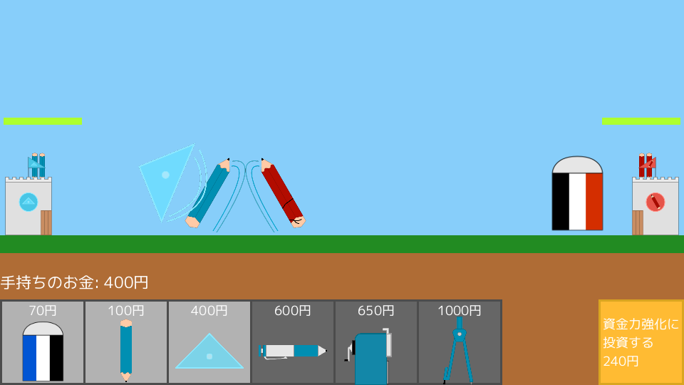

# Stationery Fight!
  
Stationery Fight is a game made with 
[OpenSiv3D](https://github.com/Siv3D/OpenSiv3D)
, a modern C++ framework.  
In the game, you can summon stationery to fight with the CPU.  
(This game is only available in Japanese.)

Stationery Fightとは、モダンなC++のフレームワークである
[OpenSiv3D](https://github.com/Siv3D/OpenSiv3D)
で作られたゲームです。  
このゲームでは、文房具を召喚することで相手(CPU)と戦うことができます。
